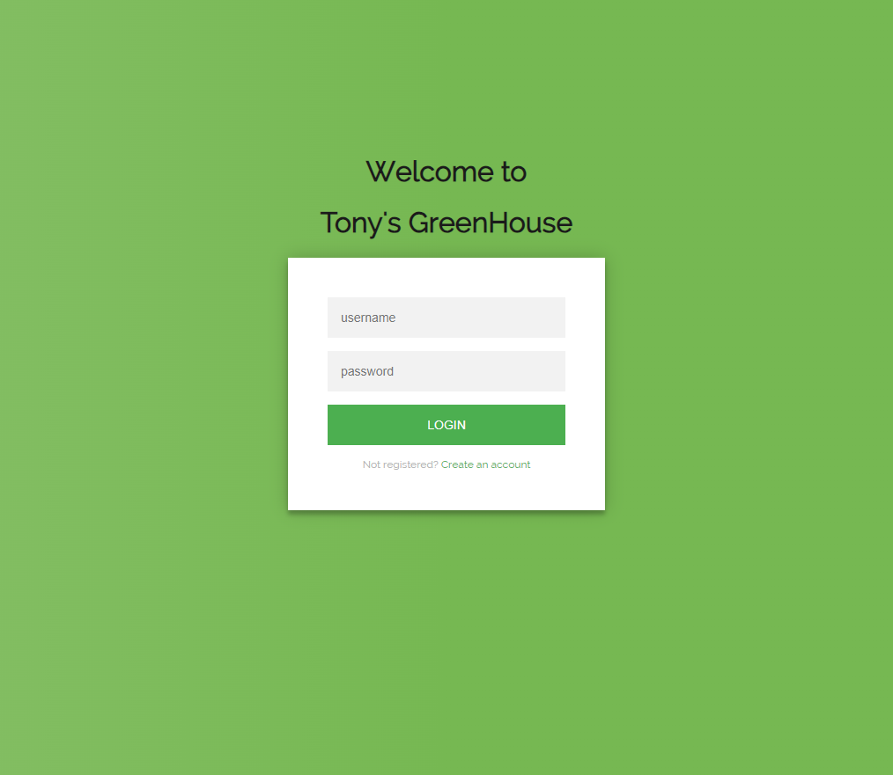
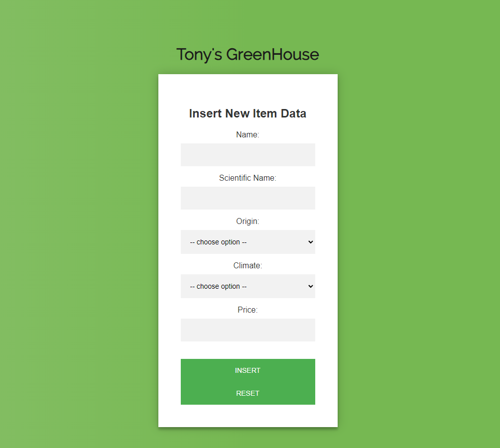
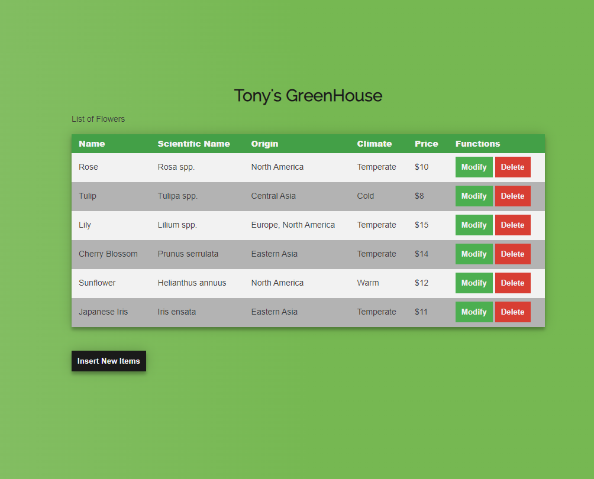

<h1>Memoria del proyecto CRUD de 2ª evaluación de Lenguajes de Marcas - 1º DAW</h1>
<h2>Tony's GreenHouse</h2>

Enlaces directos a web navegable:

- <a href="https://antoniocorderomolina.github.io/CRUD_Project/login.html">Interfaz de Login</a>
- <a href="https://antoniocorderomolina.github.io/CRUD_Project/insertion.html">Interfaz de Inserción de datos</a>
- <a href="https://antoniocorderomolina.github.io/CRUD_Project/datatable.html">Interfaz de Tabla de Datos</a>
- <a href="https://antoniocorderomolina.github.io/CRUD_Project/modification.html">Interfaz de Modificación de datos</a>

<h2 id="introduccion">Introducción</h2>

Trabajo realizado por: Antonio Cordero Molina

Proyecto de Interfaz CRUD de 2ª evaluación del módulo Lenguajes de Marcas

Enero de 2024

<h3>Interfaz Login</h3>

He utilizado dos imágenes de fondo tomadas de uno de los fotográfos del grupo (@adiazfotos), una imagen se adapta a pantallas grandes (portátil, sobremesa), por otro lado la otra se adapta a pantallas pequeñas (móvil y tablet) 
Sobre ella he colocado dos botones "Call to Action" estilados de forma sencilla

<h3>Interfaz de Inserción de datos</h3>

<h3>Interfaz de Tabla de datos</h3>

<h3>Interfaz de Modificación de datos</h3>

<h3>Tipografías</h3>

  <li>Títulos: Raleway</li>
  <li>Texto: Roboto</li>

<h2 id="snippets">Code snippets</h2>
<ul>
  <li>Login From: customizada a partir de una idea tomada de FreeFrontend.com</li>
</ul>
